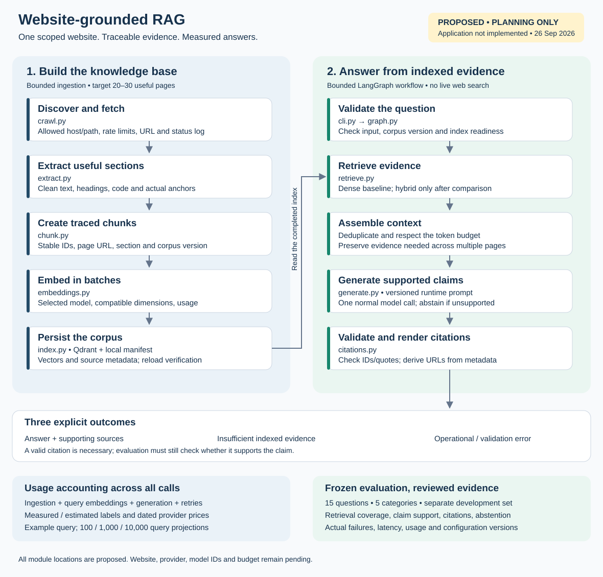

# Website-Grounded RAG Agent

A command-line system that crawls public documentation websites, builds an isolated search index per website, and answers questions **only** from the selected website's indexed pages, with source URLs, section headings, and verified quotes. It says explicitly when the indexed pages do not contain the answer.

**Status (2026-09-26):** E1 baseline and E2 grounding changes verified: 88 offline tests pass (3 live tests skipped). Three new live OpenAI baseline calls were recorded against the original corpus; updated prompt/provider evaluation is pending E6. See [evolution evidence](docs/evolution.md).



## Setup

Requires Python 3.11-3.13 and [uv](https://docs.astral.sh/uv/). Tested on Windows 11 with Python 3.13.2.

```bash
uv sync                      # pinned, locked dependencies
# Create .env from .env.example only if .env does not already exist; add your provider keys.
uv run rag doctor            # versions, key presence (never values), site readiness
uv run rag doctor --check-providers   # optional: verifies keys with a free model-listing call
uv run rag ingest --site 1   # Scrapy 2.19 docs: 45 pages, ~3 min on first run (downloads a 67 MB embedding model)
uv run rag ingest --site 2   # Python 3.13 tutorial: 17 pages, ~1 min
```

Crawling, indexing, and retrieval need no API key (embeddings run locally). A key is needed only to generate answers.

## Usage

```bash
uv run rag sites list                                   # numbered websites; 1 is the default
uv run rag ask "Which command creates a new Scrapy project?"            # site 1
uv run rag ask "How do I create a virtual environment?" --site 2
uv run rag ask "..." --provider groq --mode hybrid_rerank --show-retrieval
uv run rag chat                                         # interactive: type a number to switch sites, /add <url>, /help
uv run rag sites add https://packaging.python.org/en/latest/tutorials/ --max-pages 8
uv run rag sources <run-id>                             # evidence and ranks behind an answer
uv run rag trace <run-id>                               # stage-by-stage trace, failing stage, fallback
uv run rag runs                                         # recent runs
uv run rag costs                                        # usage ledger by phase / provider / model
uv run rag evaluate --split test --modes dense,hybrid --retrieval-only   # no API calls
uv run rag evaluate --split test --modes hybrid --provider openai        # answer-level, spend-capped
uv run pytest -q                                        # offline tests; RAG_LIVE_TESTS=1 adds live checks
```

Every command supports `--json`. `rag --no-color ...` (or `NO_COLOR=1`) disables color. Expected failures exit with code 2 and print a reason and next step; Ctrl+C during ingestion keeps the previous index active.

Providers: `--provider openai|groq|auto` (default `auto`: OpenAI first, one visible fallback to Groq on quota/availability/transient errors). Retrieval: `--mode dense|bm25|hybrid|hybrid_rerank` (default `hybrid`).

## What was selected and why

| Component | Choice | Reason (details in [decisions](docs/decisions.md)) |
| --- | --- | --- |
| Primary site | Scrapy 2.19 docs (`/en/2.19/`, 45 pages) | Rich technical content; pinned version (robots.txt disallows `/en/stable/`); 2.19 defaults differ from older releases, which tests grounding over memory |
| Second site | Python 3.13 tutorial (17 pages) | Different, smaller corpus with some topic overlap, for isolation tests |
| Vector store | Qdrant local mode, one collection per site version | Persistent, no server; separate collections make leakage structurally hard |
| Embeddings | `BAAI/bge-small-en-v1.5` (local ONNX) | No API dependency for indexing or retrieval; pinned per corpus |
| Retrieval | Hybrid dense + BM25 with reciprocal rank fusion | Chosen on the dev split; cross-encoder rerank available as an option |
| Workflow | LangGraph `StateGraph` + LangChain `ChatOpenAI`/`ChatGroq` | Explicit, testable routing for answer, abstain, and error paths |
| Generation | `gpt-4.1-mini-2025-04-14`; fallback `openai/gpt-oss-120b` on Groq | Strict JSON-schema output on both; low cost |
| Grounding | Claims with chunk IDs + verbatim quotes, validated in code; URLs from metadata | Invented sources and fabricated quotes are withheld |
| Observability | Local JSONL traces + usage ledger | Works without accounts or Docker; secrets redacted |

## Results so far

Retrieval on the frozen test split (12 answerable questions, 21 evidence groups; evidence reaching the model's context): dense 15/21, BM25 12/21, **hybrid (default) 14/21**, hybrid + rerank 17/21. Hybrid was selected on the dev split before the test run and is kept as default to avoid tuning on test; the reranker's advantage is reported, not assumed. Site isolation: 0 leaked sources across all modes. Full tables, per-case failures, and method: [docs/evaluation.md](docs/evaluation.md).

Cost (estimated until the live run): ingestion $0 API; ~2.8-3.0K input tokens per query (measured), ~$0.0017 per query on gpt-4.1-mini, about $1.69 per 1,000 queries and $16.94 per 10,000. [docs/cost-analysis.md](docs/cost-analysis.md).

## Documentation

- [Architecture](docs/architecture.md): isolation boundary, ingestion, query graph, provider error table, observability, module map, limits
- [Decisions](docs/decisions.md): each choice, alternative, and what would change it
- [Corpus coverage](docs/corpus.md): what was crawled, policies, extraction review
- [Evaluation](docs/evaluation.md): labels, metrics, retrieval comparison, failures, pending answer-level run
- [Cost analysis](docs/cost-analysis.md): measured ingestion, example query, projections
- [Walkthrough script](docs/walkthrough.md): 10-15 minute demo plan (video link pending)
- [Implementation scope](docs/implementation-scope.md): the requirements this was built against

## Known limitations

- Static HTML only; JavaScript-rendered sites fail with an explanation. Partial coverage per site (bounded crawl); results reflect the crawl snapshot.
- Local single-process storage (one `rag` process at a time).
- Answers are probabilistic: schema, prompt, and citation checks reduce unsupported content but cannot guarantee zero hallucination; a verified quote does not prove the claim follows from it.
- The evaluation set is small; it exposes failure modes and supports a relative comparison, not a production accuracy claim.
- Groq's free tier (8K tokens/min, 200K/day) supports a demo, not sustained volume.

## Repository hygiene

`.env`, `data/` (crawl snapshots, vector store, traces, ledger), and internal planning notes are git-ignored. `.env.example` contains placeholders only. Reviewed evaluation fixtures and result files are tracked under `eval/`.
