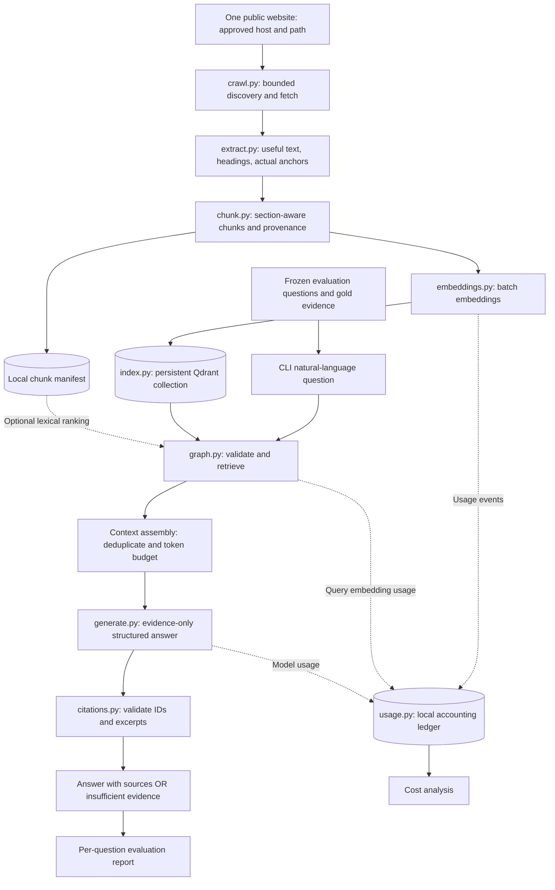
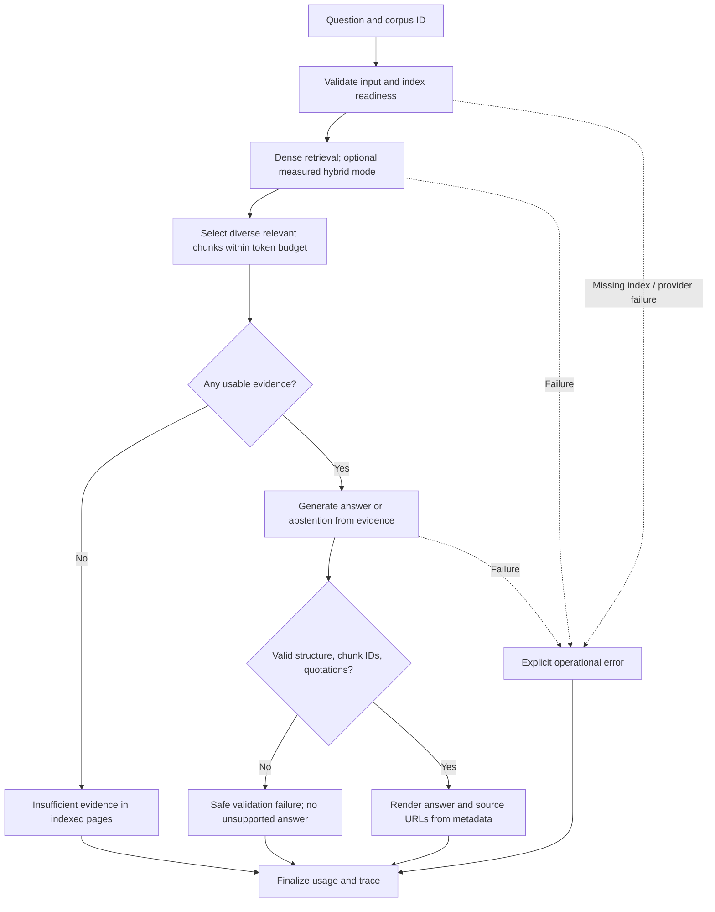
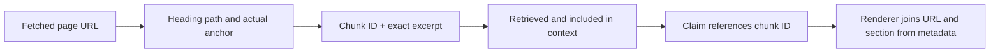

# Proposed architecture

**Status: PROPOSED, 2026-09-26. Implementation is authorized; no application components exist yet.** Read [the scope amendment](implementation-scope.md) first: it adds the site registry and selected-corpus isolation, OpenAI/Groq support, retrieval experiments, and tracing. The original flow below represents one selected website; apply it independently per corpus. Exact model IDs and dependency versions remain to be verified. All module paths below are intended locations.

## Overall flow




Crawler discovery is automatic within configured boundaries; a seed list is not a substitute for implementing internal-link discovery. Queries read a frozen index and do not browse the internet.

## Ingestion sequence

1. Validate HTTP(S) seed URL, one allowed host/path and version; reject private/local network targets and recheck redirect destinations. Use bounded page count, response size, timeout, rate and retry limits. Respect applicable robots directives and document site access constraints.
2. Discover internal links, normalize equivalent URLs, remove fragments for fetching, and reject assets, logout/search/calendar traps, other versions, and out-of-scope paths. Do not discard every query string blindly: define a site-specific parameter policy.
3. Fetch permitted HTML. Record requested URL, final in-scope URL, status, timestamp, content hash, and failure/skip reason. Honor transient-error backoff/Retry-After within the configured budget.
4. Extract main content and section structure. Remove navigation and repeated boilerplate; preserve meaningful lists, tables, and code for technical pages. A missing anchor remains absent. An external canonical tag cannot expand scope.
5. Review three representative pages before the full run. Reject empty/navigation-only pages and deduplicate content before counting accepted pages. Preserve aliases for provenance.
6. Split within sections initially around 500 tokens, with at most 75 tokens overlap inside an oversized section. These are starting settings, not measured optimal values. Prefix title/heading consistently in both indexing and query evaluation.
7. Embed in bounded batches and store vector + full chunk metadata. Persist the manifest and configuration fingerprint. Repeated identical input must not create duplicate points.
8. Fail visibly on incompatible embedding dimensions/configuration. Use a new corpus/index version when the embedding or chunking configuration changes; never silently mix versions or query an incomplete ingestion run.

## Query workflow and failure handling



LangGraph controls fixed transitions and state; it does not choose unlimited tools. The normal path uses one query embedding call and one generation call. Empty evidence skips generation. No automatic rewrite, reranking model, second judging call, or self-correction loop in the initial scope. Bounded transport retries are recorded as attempts, not hidden.

Similarity scores indicate ranking, not calibrated answerability probabilities. Empty retrieval is a definite failure to find evidence, but a nonempty result does not prove support. Generation must explicitly abstain when retrieved passages do not establish the answer. Structural citation checks catch invalid references; manual claim-level evaluation is still needed to judge support.

## Proposed repository layout

```text
src/website_rag/
  cli.py             # ingest, ask, evaluate, cost-report entry points
  config.py          # validated site/model/limit configuration
  schemas.py         # page, chunk, answer, usage contracts
  crawl.py           # URL scope, discovery, fetch records
  extract.py         # main content and heading/anchor extraction
  chunk.py           # section-aware segmentation and stable identities
  embeddings.py      # one chosen embedding adapter and usage capture
  index.py           # Qdrant persistence and corpus compatibility
  retrieve.py        # dense and optional lexical/fused candidates
  graph.py           # bounded query state and routing
  generate.py        # selected LangChain chat integration
  citations.py       # evidence validation and deterministic URL rendering
  usage.py           # request-level ledger and cost aggregation
  evaluate.py        # fixtures, retrieval metrics, answer reports
  prompts/answer_v1.txt
config/site.yaml     # public crawl scope and reproducible settings
config/pricing.json  # verified rates, date, currency, source
eval/questions.jsonl # reviewed gold questions; no secrets
eval/results/        # small reviewed reports, not raw debug dumps
tests/               # meaningful offline fixtures and selected integration tests
docs/                # architecture, decisions, evaluation, costs, walkthrough
data/                # ignored: crawl snapshots, chunks, local index, usage
```

Keep related code together until there is a real reason to split it. No abstract provider framework, repository pattern, service layer, or separate microservices are required.

## Data contracts

| Record | Required fields / invariant |
| --- | --- |
| PageRecord | page_id, requested_url, final_url, title, fetched_at, content_hash, sections, fetch status; accepted pages must be in scope |
| Section | heading_path, anchor or null, cleaned_text; an anchor exists only if extracted from the page |
| ChunkRecord | chunk_id, corpus_id, page_id, source_url, title, heading_path, anchor, chunk ordinal, text, token_count, content_hash; source text retained for audit |
| IndexManifest | corpus_id, accepted page/chunk counts, site/version scope, parser/chunker versions, embedding model/dimension, configuration hash, completion state |
| RetrievedChunk | ChunkRecord plus retriever name, rank and raw score; RRF scores are never interpreted as probabilities |
| AnswerResult | status: answered / insufficient_evidence / error; answer text, claims with evidence, limitations, corpus_id, run_id; errors have distinct reason codes |
| ClaimEvidence | claim text plus one or more chunk_id / exact quote pairs; URLs are joined from trusted indexed metadata, never generated |
| UsageEvent | run_id, operation_id, attempt_id, phase, provider, model, operation, input/output/cached tokens when available, measurement method, rate version, cost or unknown, timestamp, outcome |

IDs should derive reproducibly from canonical page identity, content, ordinal, and parser/chunker configuration. Do not rely on Python's process-dependent hash. Retain final URLs and a manifest so an ID can be traced to its actual snapshot. Stable identity must not collapse two separate evidence sections into one record.

The query state holds question, corpus_id, retrieved chunks, selected context, generation result, validation issues, operational error, and usage-event references. Store each billable call once; graph state aggregation must not double-count it.

## Retrieval and grounding decisions

Start with dense retrieval, initial candidate depth 12 and context up to 6 chunks under a configurable token budget (initially 4,000 evidence tokens, reduced if the selected model requires it). Keep original-question retrieval and page diversity; do not automatically force one chunk per page when several sections of one page are needed.

For the hybrid experiment, use the same corpus and query set with lexical BM25 + reciprocal rank fusion. The initial low-effort option is lexical ranking over the local chunk manifest with dense vectors in Qdrant. This is application-level hybrid retrieval, not a claim of Qdrant-native sparse search. If native dense+sparse Qdrant search is selected instead, document sparse encoder/storage requirements and verify local-client support before changing the implementation prompt. Choose one hybrid implementation, not both.

Preserve the dense-only mode for the comparison. Do not add a reranker unless observed failures justify its model/dependency costs. Relevant passages from multiple pages must survive context selection.

## Provenance example (illustrative only)



A valid chunk reference only proves the passage was retrieved. It does not prove the passage supports the claim. Evaluate citation correctness, claim support, and answer completeness separately. If an anchor is missing, show the page URL and heading label; do not synthesize a deep link.

## Known limits and validation plan

Single-process local storage; static HTML first; partial coverage per website; snapshot drift; probabilistic model behavior; imperfect parsing of complex layouts. A 15-question evaluation can reveal failures but cannot establish production accuracy. Prompt rules and quotation checks reduce some failure modes but cannot guarantee zero hallucination. The scope amendment adds registry.py, provider/error handling, and local tracing responsibilities to the module map; finalize those boundaries during M1.

M2 verifies page quality and crawl boundaries. M3 verifies index reuse and retrieval evidence. M4 verifies graph behavior and provenance. M5 compares retrieval/answer quality on frozen labels. M6 verifies cost arithmetic. M7 checks a fresh setup and reconciles this document with actual code.

## Official capability references

Checked 2026-09-26: [LangGraph workflow patterns](https://docs.langchain.com/oss/python/langgraph/workflows-agents), [Qdrant client local mode](https://github.com/qdrant/qdrant-client), and [Qdrant hybrid query documentation](https://qdrant.tech/documentation/search/hybrid-queries/). These support available capabilities; the proposed architecture and settings are project design choices, not measured conclusions.
