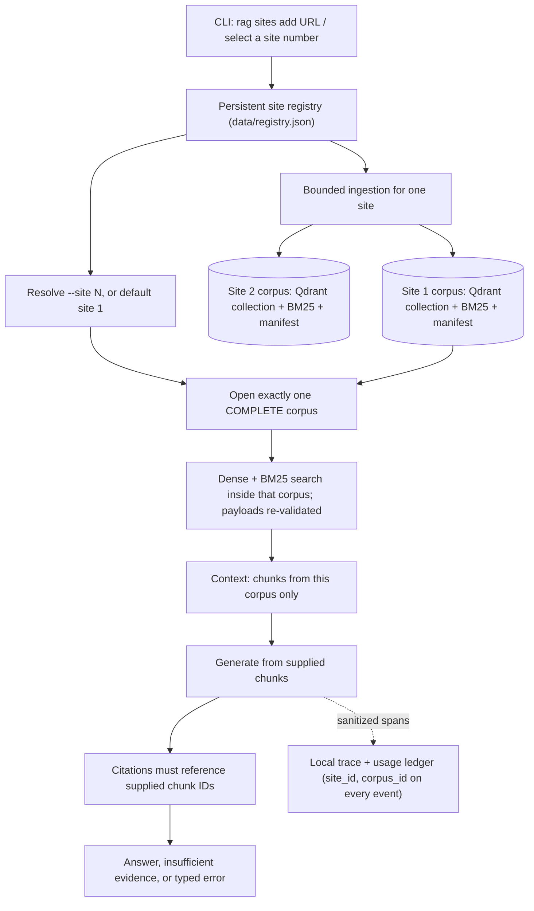
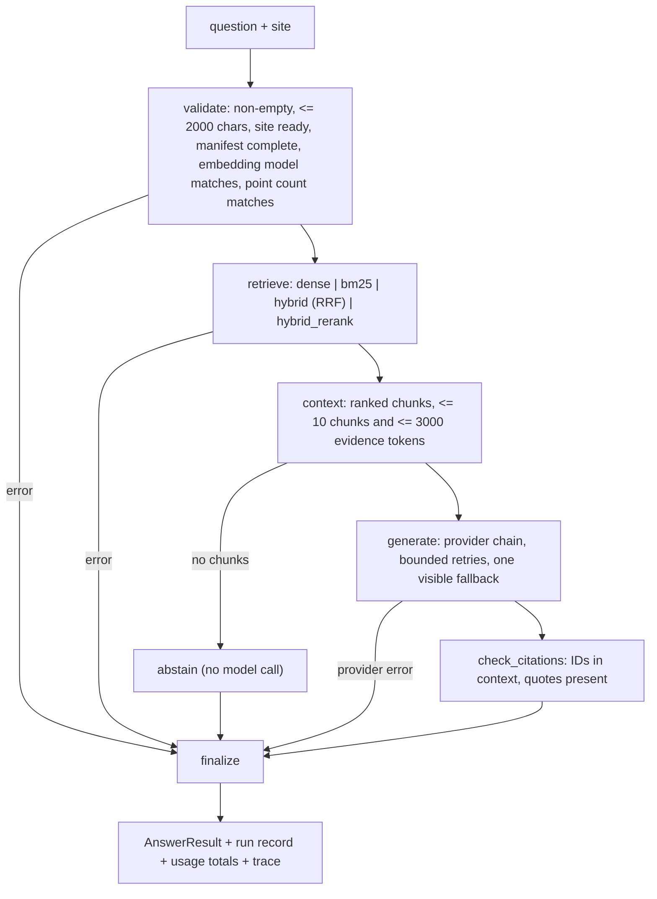

# Architecture

**Status: implemented, offline-tested and exercised with both providers (2026-09-26).** See [evaluation](evaluation.md) for measured quality and remaining semantic failures.


[Interactive architecture and question workflow](diagrams/README.md) are source-backed Archify artifacts with editable JSON and browser-reviewed PNG fallbacks.

The system has three parts: per-site **ingestion**, isolated per-site **corpora**, and a bounded **query workflow**. Local traces, a usage ledger, and an evaluation harness observe all three.

## Selected-site boundary



Isolation is enforced in code at four points, not by the prompt:

1. **Storage.** Every ingestion creates a new corpus with its own Qdrant collection (`corpus_<corpus_id>`), its own `chunks.jsonl` (the BM25 source), and a manifest ([index.py](../src/website_rag/index.py)).
2. **Retrieval.** Dense search additionally filters on `site_id` and `corpus_id`, and every returned chunk, dense or lexical, is re-checked; a foreign chunk raises `index_incompatible` instead of being used ([retrieve.py](../src/website_rag/retrieve.py) `_check_isolation`).
3. **Citations.** A claim may cite only chunk IDs that were sent to the model in this run ([citations.py](../src/website_rag/citations.py)).
4. **Session state.** `rag chat` clears the last answer and evidence when the site changes; questions are independent (no conversation memory).

Tests cover an answer that exists only on site B asked on site A (every retrieval mode), contradictory values for the same setting on two sites, a citation to another site's chunk, and a tampered lexical index ([tests/test_pipeline.py](../tests/test_pipeline.py)).

## Ingestion

Registry scope supports explicit extra path prefixes, seeds and bounded sitemaps. `checkpoint.py` persists each extracted page and an atomic frontier/outcome/configuration record; accepted pages are reused on resume. A crawl checkpoint is separate from a completed query index. Additive path/limit changes may resume; incompatible extraction policy or narrowed scope requires refresh. Sitemaps reject entity/DTD declarations and enforce host/path/redirect, robots, bytes, count, depth and discovered-URL limits. Discovery can stop at a cap, so frontier exhaustion is only within the declared scope and discovery policy.

`--refresh` fetches a new snapshot; `--resume` continues durable work. Conditional ETag/304 fetching is not implemented. Existing active indexes remain queryable until the replacement has been fully written and checked; transport failures do not delete old pages. Raw HTML is compressed per page, embeddings/Qdrant writes use batches, and a 30,000-chunk cap bounds the remaining in-memory index matrix. Accepted-page caps constrain the fetch batch before requests are sent, so fetched outcomes are not silently discarded. See [coverage](corpus.md) for the exact current corpus versions and bounds.

| Stage | Module | What it does |
| --- | --- | --- |
| Registry | [registry.py](../src/website_rag/registry.py) | Stable numbers from a monotonic counter (never reassigned), default site 1, equivalent-URL detection (same host + path prefix returns the existing site). |
| URL policy | [urls.py](../src/website_rag/urls.py) | http(s) only; lowercase host, drop default port, fragment, and query string; `index.html` = directory; exact-host + path-prefix scope; asset and trap patterns excluded; hosts resolving to non-global IPs rejected. |
| Crawl | [crawl.py](../src/website_rag/crawl.py) | Breadth-first internal-link discovery from the seed. Bounds: accepted pages, 3x fetch attempts, depth, bytes per page (streamed), per-request timeout, total time, request interval (robots `Crawl-delay` honored), concurrency, retries (429/5xx/timeouts with backoff and `Retry-After` up to 30 s). Redirects are followed manually and every hop is scope- and robots-checked. Every URL ends up accepted, skipped, or failed with a reason. |
| Extract | [extract.py](../src/website_rag/extract.py) | Discovery links are taken from the whole page; content from the main container only. Removes navigation, sidebars, footers, scripts, permalink glyphs. Headings become sections; an anchor is recorded only when the page defines that id. Code blocks are fenced, lists become `- ` items, tables become `a | b` rows. `noindex` pages and pages under 80 words are skipped; content-hash duplicates are skipped. |
| Chunk | [chunk.py](../src/website_rag/chunk.py) | Chunks never cross a section; oversized sections split at block boundaries (~320 tokens, 48-token block overlap). Chunk ID = hash of chunker version, site, URL, ordinal, and text, so identical content keeps its ID across refreshes. Title + heading path are prefixed for embedding/BM25 but not to the quotable evidence text. |
| Embed | [embeddings.py](../src/website_rag/embeddings.py) | Local `BAAI/bge-small-en-v1.5` (384-d, ONNX via fastembed). Vectors for unchanged chunks are reused from the previous corpus. |
| Index | [index.py](../src/website_rag/index.py), [ingest.py](../src/website_rag/ingest.py) | Manifest starts `building`; becomes `complete` only after the point count matches the chunk count. The registry's `active_corpus_id` changes only then. A failure or Ctrl+C marks the new manifest `failed` and keeps the previous corpus serving queries. |

## Query workflow



[graph.py](../src/website_rag/graph.py) builds a LangGraph `StateGraph` with typed state (`QueryState`). The graph fixes every transition; there are no loops, tool choices, query rewriting, or judge calls. A normal answer uses one local query embedding and one generation call.

**Why LangGraph here.** The value is explicit, testable routing: validation, abstention, provider failure, and citation failure are separate edges that tests exercise and traces display. It does not improve retrieval or answer quality by itself; a plain LangChain sequence could implement the same path. LangChain supplies the provider integrations (`ChatOpenAI`, `ChatGroq`) and strict structured output.

**Generation contract (answer_v2).** The provider returns `AnswerSelection`: status and claims with chunk/passage IDs. Application-generated paragraph spans bind exact offsets to chunk content; quotations and URLs are reconstructed locally. Escaped evidence remains untrusted data. There is no independent answer, premise, or missing-information prose in the provider schema. Displayed answers are constructed only from accepted claims. Partial citation failures receive a citation-failure explanation, not a false coverage diagnosis.

**Citation checks.** Chunk and passage IDs must have been supplied for this run. Legacy `AnswerDraft` remains readable for fixtures; quotes must match contiguously with whitespace-only normalization, preserving case, punctuation, and negation. Ellipsis is literal, never a license to omit text. Structural linkage does not prove semantic entailment; explicit review remains necessary. Existing indexes need no migration: spans are computed from stored chunk text at query time. Old saved runs remain loadable and terminal replay reconstructs accepted claims instead of displaying old unchecked prose.

**Abstention wording.** `The indexed pages for <site> do not contain enough information to answer this question.` This is the model's evidence-limited judgment, not proof that the answer is absent from the whole index or live site. Evaluation records false abstentions separately.

## Providers and failures

[providers.py](../src/website_rag/providers.py) classifies every SDK exception from HTTP status and the provider's error `code`/`type`:

| Condition | Code | Retried | Auto fallback |
| --- | --- | --- | --- |
| 429 `credit_balance_exhausted` | `credits_exhausted` ("OpenAI API credits are exhausted. Please recharge your API billing account, or use the configured Groq provider.") | no | yes |
| 429 `insufficient_quota` / "exceeded your current quota" | `quota_exceeded` (check billing and limits; not asserted as exhausted credits) | no | yes |
| 429 `*_spend_limit_exceeded`, `organization_usage_limit_exceeded` | `spend_limit` | no | yes |
| other 429 (incl. Groq TPM/TPD) | `rate_limited` | yes, bounded | yes |
| 500/502/503/504 | `server_error` | yes, bounded | yes |
| timeout / connection | `timeout` / `connection_error` | yes, bounded | yes |
| 404, `model_not_found`, `model_decommissioned` | `model_unavailable` | no | yes |
| 401 / 403 | `auth_invalid` / `permission_denied` | no | no (fix configuration) |
| 413, `context_length_exceeded` | `request_too_large` | no | no |
| schema/parse failure | `malformed_response` | no | no |

SDK retries are disabled (`max_retries=0`); the application retries at most `RAG_MAX_ATTEMPTS_PER_PROVIDER` (3) times within `RAG_RETRY_BUDGET_S` (60 s), honoring `Retry-After` up to 20 s and never waiting on longer windows (e.g. Groq daily limits). `auto` tries OpenAI then Groq once; there is no path back. Explicit `--provider openai|groq` never falls back. Selected site, corpus, and retrieved evidence are unchanged across fallback; the result records actual provider/model and the reason.

## Observability and accounting

- **Traces** ([tracing.py](../src/website_rag/tracing.py)): `data/traces/<run_id>.jsonl`, one event per span with trace/run/span/parent IDs, kind, site/corpus, stage, duration, status, error code, and attributes (retrieval ranks and scores, context chunk IDs and pages, provider attempts with usage and cost). API-key, bearer, and `api_key=` patterns are redacted from every string. Prompts and page bodies are not written. `--debug` adds sanitized stack traces. Trace write failures are counted and never mask the original error. `rag trace <run-id>` renders the tree and names the failing stage.
- **Usage ledger** ([usage.py](../src/website_rag/usage.py)): `data/usage/ledger.jsonl`, one event per call attempt (retries and fallback attempts are separate events sharing an `operation_id`). Provider-reported tokens when available; cost from [config/pricing.json](../config/pricing.json) (dated 2026-09-26). Unknown usage yields cost `null`, counted as `unknown_cost_events`, never zero. Local embedding is recorded with an o200k token count and $0 API cost.
- **Run records**: `data/runs/<run_id>.json` holds the full `AnswerResult` for `rag sources`.

## Repository map

```text
src/website_rag/
  cli.py          Typer/Rich commands, JSON output, error rendering
  render.py       safe terminal rendering (control sequences stripped, no markup parsing)
  config.py       environment/.env settings (keys as SecretStr)
  schemas.py      typed records: sites, pages, chunks, manifests, answers, usage
  errors.py       typed error codes
  registry.py     persistent numbered site registry
  urls.py         normalization, scope, private-network checks
  crawl.py        bounded crawler
  extract.py      main-content, sections, anchors
  chunk.py        section-aware chunks and IDs
  embeddings.py   local embedding and reranker models
  index.py        per-corpus Qdrant + BM25 + manifest
  ingest.py       ingestion pipeline and safe activation
  retrieve.py     dense / BM25 / RRF / rerank, context selection
  generate.py     LangChain chat models, prompt assembly, usage extraction
  citations.py    claim/quote validation
  providers.py    error classification, retries, fallback chain
  graph.py        LangGraph workflow, budgets, run records
  tracing.py      JSONL traces and redaction
  usage.py        pricing and ledger
  evaluate.py     evaluation harness
  prompts/answer_v1.md
config/           default sites, dated prices
eval/             frozen questions and reviewed result files
tests/            offline unit/integration/CLI tests; opt-in live tests
data/             (ignored) registry, crawl snapshots, Qdrant, traces, ledger, runs
```

## Known limits

- Static HTML only: JavaScript-rendered sites are detected heuristically and fail with an explanation.
- Local single-process storage: Qdrant local mode locks its directory, so run one `rag` process at a time.
- DNS is checked before crawling, but a host that changes resolution between the check and the connection (DNS rebinding) is not re-verified per connection.
- The Scrapy corpus is a bounded 45-page breadth-first sample of 128 discovered in-scope pages; the release notes page is excluded by design.
- Answers are probabilistic. The prompt, schema, and citation checks reduce unsupported content but cannot guarantee zero hallucination; a valid quote does not prove entailment.
- The evaluation set is small (15 test questions); it reveals failure modes but does not establish production accuracy.
