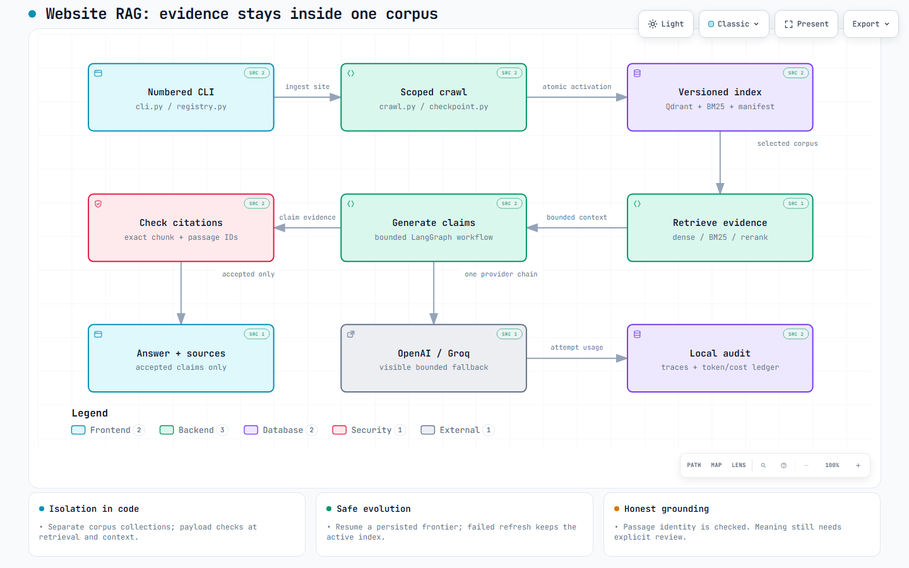

# Implemented system diagrams

Download the HTML files and open them in a browser; GitHub does not execute HTML previews. Each file is standalone, with inline SVG, light/dark themes, search, focus, pan/zoom and export controls supplied by Archify 2.16. No server or live telemetry is connected.

| Diagram | Interactive HTML | Editable source | Static preview |
| --- | --- | --- | --- |
| Implemented architecture | [Open/download](implemented-architecture.html) | [JSON](implemented-architecture.json) | [PNG](implemented-architecture.visual-check.2048x1320.light.png) |
| Question evidence path | [Open/download](evidence-path.html) | [JSON](evidence-path.json) | [PNG](evidence-path.visual-check.2048x1320.light.png) |

The architecture's 15 source references resolve against repository commit `50960c3`. It shows actual local components, not a proposed cloud deployment. The workflow corresponds to `graph.py`: validate/retrieve, context, generation, citation checks, and explicit failure/abstention branches. All branches finalize local accounting; this is not an autonomous agent loop.

An illustrative **recorded** path is run `r-e82762d31b534721`: site 2, expanded Python corpus, `hybrid_rerank`, OpenAI, `input()` answer with the indexed `builtins/functions.html#input` source. Locally use `rag trace r-e82762d31b534721` and `rag sources r-e82762d31b534721`. The reviewed portable record is in [answer evidence](../../eval/results/evolution-live/answers.jsonl); raw local traces are not published. This example does not animate or stream live telemetry.

[Validation receipts](validation.json) preserve specification/artifact SHA-256, byte counts, all nine passing showcase checks, zero composition errors/warnings, repository verification and browser measurements. Chrome containment passed at 1440x900, 1600x1000, 1920x1080 and 2048x1320. Codex visually inspected light/dark screenshots at the smallest and largest sizes after repairing overflow and spacing. The tool's raw sidecars retain `visualReview: pending` by design; the separate review records actual screenshot inspection. Interactive export buttons were not separately exercised.

[CLI recorded answer preview](cli-input-replay.svg) comes from the real saved OpenAI run, rendered through the production Rich renderer. It is explicitly labeled as a replay.
