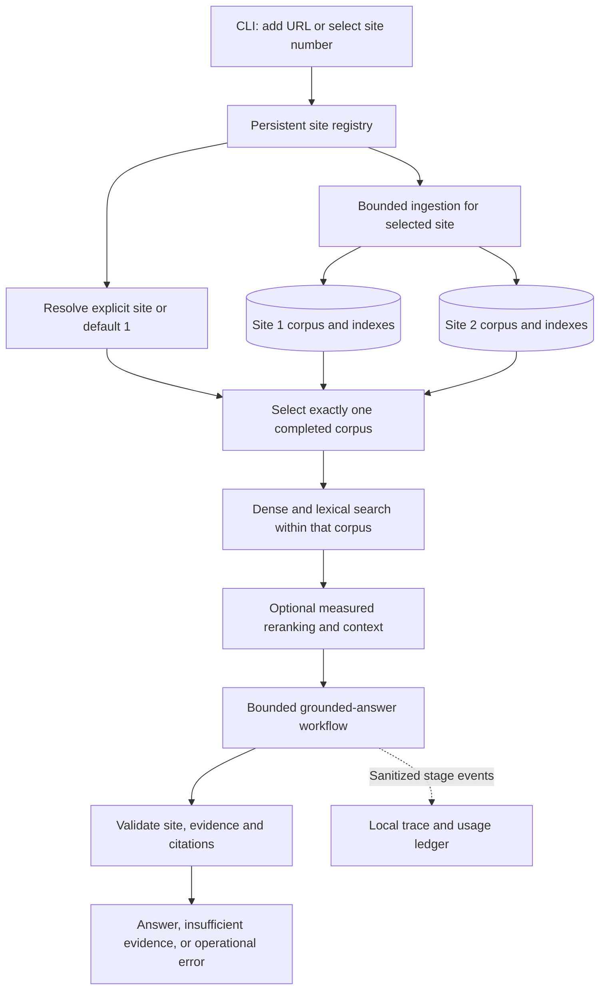

# Implementation scope and accepted direction

Updated 2026-09-26. **Implementation authorized; application not yet implemented.** This amendment supersedes earlier single-corpus and planning-only restrictions. The existing milestone plan remains the execution structure.

## Required experience

A polished Python CLI with numbered website selection, default website 1, and bounded ingestion of a new public URL during a demo. Every question must use only the selected website's completed corpus. Show the active website, sources/sections, provider, timing, usage/cost, and trace ID. Include noninteractive commands, JSON output, and no-color support.

Use stable site numbers and a persistent registry. Keep independent indexes per site/corpus, including lexical rankings; validate site identity through retrieval, context, generation, citations, and traces. Never use another website to fill evidence gaps. Refresh a site without replacing its last usable corpus until the new ingestion succeeds.

The preferred first corpus is [Scrapy documentation](https://docs.scrapy.org/en/latest/), subject to robots/access, version/path, extraction-quality, and 20-useful-page validation. A small second site demonstrates isolation. New URL support is bounded static-HTML ingestion, not a promise that every public website is supported.

## Selected-site boundary

Both stored corpora are available to the selector; only one is chosen for a query. No all-site search or cross-site answer synthesis is in scope. Tests must catch answers/citations leaking from another site, including when topics overlap.

## Technical direction and rationale

- Typer/Rich CLI and persistent local Qdrant are the proposed implementation defaults.
- Use a bounded LangGraph workflow with LangChain provider integrations for explicit routing and inspectable state. Explain the actual benefit; the framework itself does not establish retrieval quality.
- Prefer a tested CPU-capable local embedding model so generation-provider quota failure does not disable retrieval. Pin model/configuration per corpus; never change embedding space silently.
- Implement dense and dense+BM25 rank-fusion modes and compare them. Time-box a local cross-encoder experiment. Choose using development evidence and report frozen test results; no universal accuracy claim.
- OpenAI and Groq generation support: explicit provider modes plus visible bounded auto fallback. Do not collapse authentication, billing, spend-limit, rate-limit, or transient failures into one error.
- Mandatory structured local traces and readable trace inspection. Optional Langfuse is disabled by default; Docker and hosted observability must not be prerequisites.
- Versioned runtime prompts, metadata-derived URLs, quote/ID checks, and manual semantic-support evaluation remain necessary.

## Evidence and delivery

Main-site evaluation: 15 reviewed questions across five required categories, a separate development set, plus site-isolation and failure tests. Record actual provider/model, corpus/prompt/configuration, latency, usage, and failures. Verify real integrations separately from mocked tests.

Report actual ingestion/example-query usage and costs at 100/1,000/10,000 queries. Separate measured free-tier charges from published-rate projections and quota assumptions. Do not assume free Groq capacity at every scale or zero local compute cost.

Exact submission deadline and numeric API budget have not been provided. Keep runs small, bounded, and configurable; larger paid experiments require a cap. Missing credentials block only dependent live checks.

Complete README, architecture, corpus coverage, decisions, evaluation, costs, limitations, and a 10-15 minute walkthrough script. The user records and submits the video. Maintain verified milestone commits/pushes, ignored internal learning notes, and clear implemented-versus-tested status.

## Provider references

Checked 2026-09-26: [OpenAI API errors](https://developers.openai.com/api/docs/guides/error-codes) distinguishes billing/spend failures from temporary rate limits; permanent billing failures should not be retried. [Groq rate limits](https://console.groq.com/docs/rate-limits) documents quota/rate constraints. Recheck selected model IDs, structured-output support, and prices during implementation.
